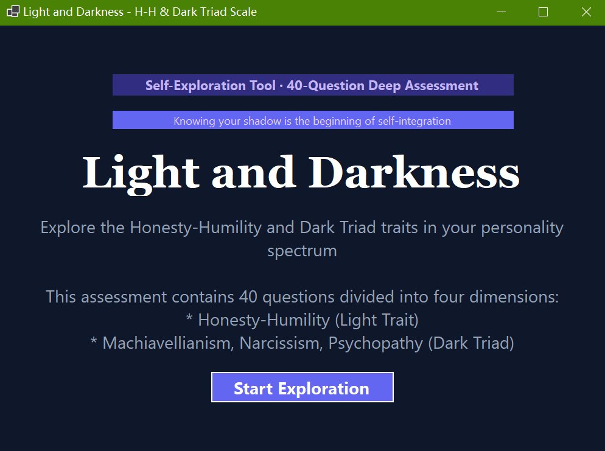

# Honesty-Humility & Dark Triad Short Scale



## Disclaimer: Self-Exploration Only
*__This application is not a substitute for professional psychological assessment or counseling. Results are intended solely for self-reflection and personal growth, and shall not be used for clinical diagnosis or decision-making purposes.__*

Adapted from the publicly available versions of the HEXACO model and the Dark Triad scale, this project serves as a self-exploration tool to help individuals understand and reflect on the Honesty-Humility and Dark Triad personality dimensions. It is intended for personal use only and should never replace professional psychological advice.

If any assessment content is found to violate copyright guidelines, please contact me via email at [benjamin_2001@qq.com](mailto:benjamin_2001@qq.com) to request its removal.

## Description
The Honesty-Humility & Dark Triad Short Scale is a VB.NET WinForms desktop application that features a 40-question assessment designed to measure four key personality dimensions:

- **Honesty-Humility (H-H)**: Evaluates sincerity, fairness, resistance to greed, and modesty
- **Machiavellianism**: Assesses strategic manipulation, cold calculative thinking, and long-term planning tendencies
- **Narcissism**: Measures self-admiration, feelings of superiority, and the desire for power and admiration
- **Psychopathy**: Gauges emotional detachment, fearlessness, and lack of empathy

The application offers an intuitive user interface for completing the assessment, with real-time progress tracking and detailed results visualization - including radar charts and dimension-specific score breakdowns.

## Features

### Core Features
- **40-Question Assessment**: Comprehensive measurement of four core personality dimensions
- **Real-Time Progress Tracking**: Visual progress bar and dimension-specific progress indicators
- **Detailed Results Visualization**: Radar chart profiling and in-depth score analysis for each dimension
- **Full English Language Support**: All assessment items and interface elements are fully translated into English
- **Printable/Savable Results**: Option to save or print assessment results for personal reference
- **Retake Functionality**: Easy retesting option to complete the assessment multiple times

### Technical Features
- **VB.NET WinForms Framework**: Modern, user-friendly Windows desktop interface
- **Strict Data Validation**: Ensures all 40 questions are completed before submission
- **Robust Error Handling**: Comprehensive error management for a seamless user experience
- **Local-Only Processing**: All results are calculated and displayed locally - no data is transmitted externally

## Installation

### Prerequisites
- Windows 10 (or later) operating system
- [.NET SDK 10](https://dotnet.microsoft.com/download/dotnet/10.0) or newer
- Visual Studio 2026 (for direct project execution) or Visual Studio Code (for manual build/run)

### Setup
#### Option 1: Visual Studio 2026 (Simplified Execution)
1. Clone or download the source code from the repository:
   ```bash
   git clone https://github.com/Pac-Dessert1436/HH-Dark-Triad-Short-Scale.git
   ```
2. Open the project in Visual Studio 2026 (double-click the project/solution file)
3. Run the application directly by:
   - Clicking the "Start Debugging" button (▶️) in the toolbar, or
   - Pressing the F5 key

#### Option 2: Visual Studio Code (Manual Build/Run)
1. Clone or download the source code from the repository:
   ```bash
   git clone https://github.com/Pac-Dessert1436/HH-Dark-Triad-Short-Scale.git
   ```
2. Navigate to the project directory:
   ```bash
   cd HH-Dark-Triad-Short-Scale
   ```
3. Build and launch the application via the terminal:
   ```bash
   dotnet build
   dotnet run
   ```

## Usage
1. **Launch the Application**: Open the executable file (or run via Visual Studio/VS Code as outlined above)
2. **Review the Introduction**: Read the assessment overview and descriptions of the measured personality dimensions
3. **Complete the Assessment**: Answer all 40 questions by selecting your level of agreement (1–5 Likert scale)
4. **View Results**: Examine your personality profile, including radar chart visualization and dimension-specific score analysis
5. **Save/Print Results**: Use the print function to save a copy of your results for personal reference
6. **Retake the Assessment**: Click the "Retake Test" button to complete the assessment again

## Technical Details

### Project Structure
- `frmMain.vb`: Main form containing the introduction and navigation to the assessment
- `frmQuestions.vb`: Questions form containing the full assessment interface and core logic
- `frmResults.vb`: Results form displaying the final assessment profile and score breakdown
- `LICENSE`: BSD 3-Clause License file
- `README.md`: Project documentation (this file)

### Scoring System
- **5-Point Likert Scale**: Responses range from 1 (Strongly Disagree) to 5 (Strongly Agree)
- **Reverse Scoring**: Selected items use reverse scoring to mitigate response bias
- **Percentage Conversion**: Raw scores are converted to percentages for intuitive interpretation
- **Independent Dimension Analysis**: Each personality dimension is scored independently and compared across the spectrum

## Contact
For questions, feedback, or copyright concerns:
- Submit an issue: [GitHub Issues](https://github.com/Pac-Dessert1436/HH-Dark-Triad-Short-Scale/issues)
- Email: [benjamin_2001@qq.com](mailto:benjamin_2001@qq.com)

## Acknowledgments
- Built on foundational research from the HEXACO Personality Inventory and Dark Triad personality studies
- Inspired by accessible psychological assessment tools for self-reflection and growth
- Designed exclusively for educational and personal development purposes

## License
This project is licensed under the BSD 3-Clause License. See the [LICENSE](LICENSE) file for full details.